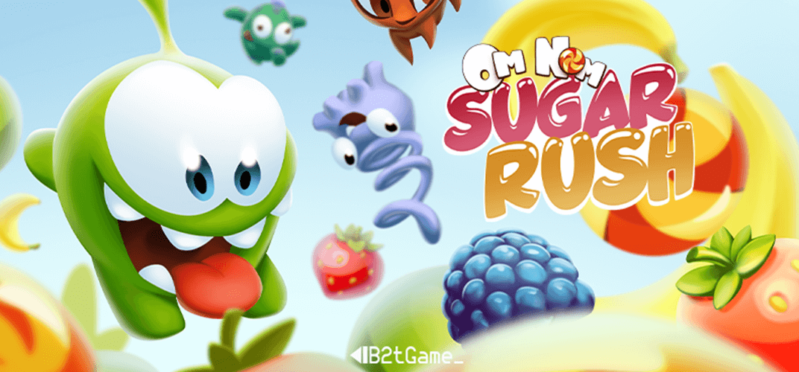

## Om Nom Sugar Rush

### Game Description

Om Nom Sugar Rush is a reinvented match-3 game where players utilize adorable creatures, called "Nommies," as powerful aids to accomplish various objectives.

With a fresh twist on the classic genre, players embark on a sweet-filled adventure. Players can swap and match colorful fruits to gain points and use Nommies' unique abilities, such as clearing entire rows or unleashing explosive candy.

The game can be found on the [ONMO](https://https://play.onmo.com/) platform.

### Nommies

Players can use the nommies as power ups to help them achieve unique combos.

#### Blasek

#### Camo

#### Toss

#### Roto

### Technology

The game has been made using **Unity** (ECS-DOTS).
