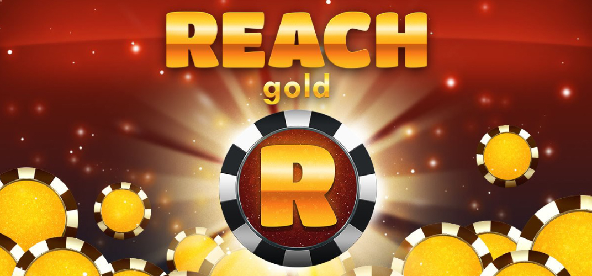

## Reach Gold

### Game Description

Reach Gold is an exciting tile-matching game where players aim to connect at least three coins of the same type by strategically dragging and dropping them into a slot machine. Matching coins results in their destruction, rewarding the player with points. The game introduces a dynamic element where matched coins create gaps, causing the remaining coins to shift upwards to fill the void. To maintain progress, players must continuously make matches and prevent the coins from reaching the bottom of the slot machine. With each move, the coins descend, adding a sense of urgency and challenge. The objective of Reach Gold is to accumulate as many points as possible by strategically planning moves and creating cascading matches

The game can be found on the [ONMO](https://https://play.onmo.com/) platform.

### Technology

The game has been made using **Unity** (ECS-DOTS).

