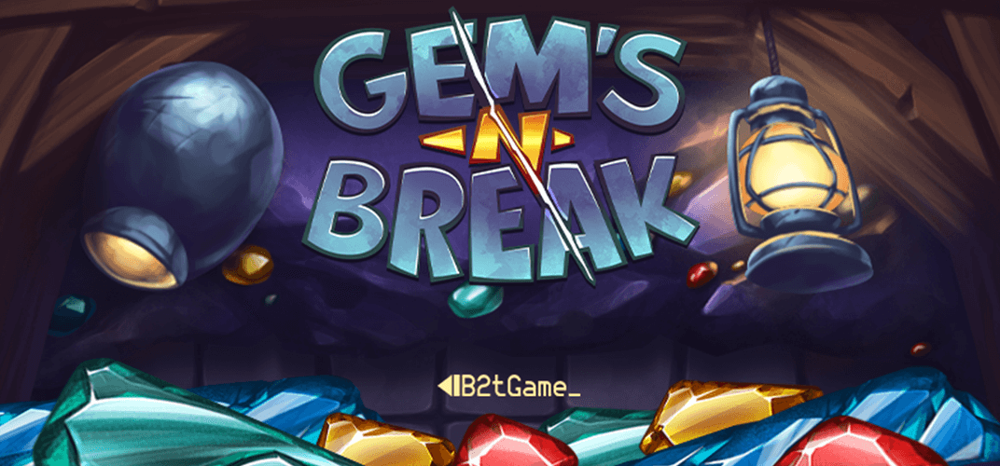

## Gems N Break

### Game Description

Gems N Break is an exhilarating puzzle game that challenges players to strategically drag gems horizontally, causing them to fall and fill lines in a grid. The more lines filled, the higher the score obtained. To aid in their quest, players can utilize powerful tools such as dynamite to explode gems, a shovel to shift all the gems upwards, and a special move to simultaneously drag two gems. When a line is completed, players earn points, and all the gems within that line are obliterated, creating space for the gems above to cascade down. The objective of Gems N Break is to destroy as many gems as possible while preventing any tile from reaching the top of the grid.

The game can be found on the [ONMO](https://https://play.onmo.com/) platform.

### Technology

The game has been made using **Unity** (ECS-DOTS).

