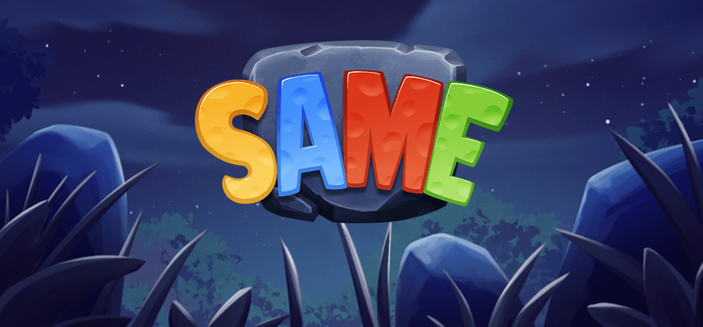

## Same

### Game Description

Same is a thrilling, fast-paced match-3 game that will put your reflexes and strategic thinking to the ultimate test. With a simple click, players must connect and explode runes of the same type, triggering a chain reaction of phenomenal destruction within the grid. The more runes connected and exploded, the more powerful special tiles will appear, offering even greater devastation.

Speed is the key to success in Same, as players who swiftly make matches are rewarded with bigger awards. However, beware! Clicking on a rune that is not connected to at least three other runes will result in immediate defeat, adding an intense element of risk and challenge.Prepare to be mesmerized by the dazzling visual effects and addictive gameplay of Same.

The game can be found on the [ONMO](https://https://play.onmo.com/) platform.

### Technology

The game has been made using **Unity** (ECS-DOTS).

