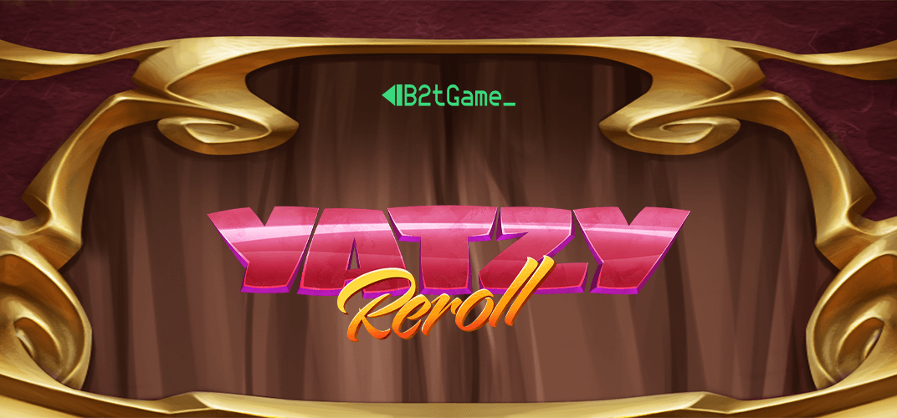

## Yatzy Reroll

### Game Description

Yatzy Reroll is an exciting twist on the classic game of Yahtzee, taking it to new heights with innovative features that offer additional opportunities to score big. Players engage in a strategic battle against both themselves and other opponents, aiming to achieve the highest possible score.

Just like in traditional Yahtzee, players roll dice to form specific combinations and earn points. However, Yatzy Reroll introduces a new element: the ability to reroll certain dice for a chance at better outcomes. This strategic decision-making adds depth and excitement, allowing players to optimize their scores.

The game can be found on the [ONMO](https://https://play.onmo.com/) platform.

### Technology

The game has been made using **Unity** (ECS-DOTS).

