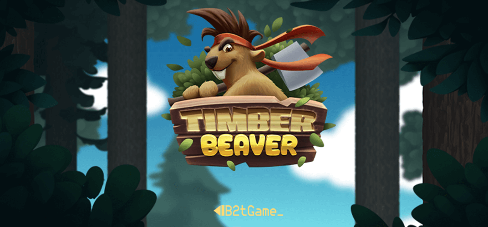

## Timber Beaver

### Game Description

Timber Beaver puts players in the role of a nimble beaver, tasked with cutting down trees with lightning speed. As the timer ticks down, players must chop trees as quickly as possible to earn points and advance to higher levels.

However, the forest poses challenges in the form of branches that jut out from trees. Players must carefully maneuver through the dense foliage, avoiding collisions with branches that can slow them down and hinder their progress. To make matters more intense, the beaver must also defend itself from other formidable creatures of the forest.

### Technology

The game has been made using **BabylonJS**.

